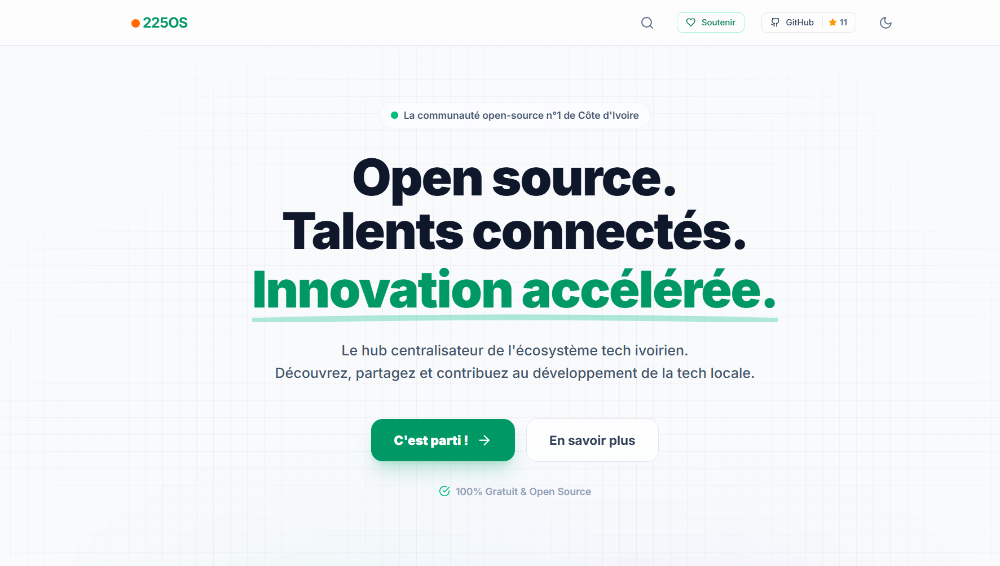

<div align="center">
  

  
  # 225 Open Source
  
  **The #1 Open Source Community Platform for Côte d'Ivoire**
  
  [](https://opensource.org/licenses/MIT)
  [](https://reactjs.org/)
  [](https://www.typescriptlang.org/)
  [](https://supabase.com/)
  
  [Live Demo](https://225os.com) • [Report Bug](https://github.com/princekouame/225_OS/issues) • [Request Feature](https://github.com/princekouame/225_OS/issues)
</div>

---

## About The Project

**225 Open Source** is a centralized platform showcasing open source projects built by developers in Côte d'Ivoire. While GitHub is the world's largest open source platform, it lacks a crucial feature: **filtering projects by country**. That's where we come in.

### The Problem We Solve

- **No Country Filter on GitHub**: Impossible to easily discover open source projects created by Ivorian developers
- **Limited Visibility**: Ivorian talents remain hidden in the global ocean of open source projects
- **Fragmented Collaboration**: Difficult for Ivorian developers to find each other and collaborate

### Our Solution

- **Smart Centralization**: We aggregate Ivorian open source projects from GitHub
- **Country Filtering**: Instant access to all open source projects created in Côte d'Ivoire
- **Unified Community**: A central space to discover, contribute, and collaborate with local talents

---

## Features

- **Project Discovery**: Browse and search open source projects from Ivorian developers
- **Global Search**: Advanced real-time search for projects and talents
- **Talents Showcase**: Discover and connect with Ivorian developers and their expertise
- **Donation System**: Support the platform and local open source initiatives
- **Smart Filtering**: Filter projects by technology, category, and popularity
- **User Profiles**: Showcase your projects, skills, and social links
- **Favorites System**: Save and track projects you're interested in
- **Dark Mode**: Beautiful UI with light and dark themes
- **Secure Authentication**: Powered by Supabase with email and GitHub OAuth
- **Responsive Design**: Optimized for desktop, tablet, and mobile

---

## Getting Started

### Prerequisites

- **Node.js** (v18 or higher)
- **npm** or **yarn**
- **Supabase Account** (for backend services)

### Installation

1. **Clone the repository**
   ```bash
   git clone https://github.com/kouame09/225_OS
   cd 225_OS
   ```

2. **Install dependencies**
   ```bash
   npm install
   ```

3. **Set up environment variables**
   
   Copy the `.env.example` file to `.env.local`:
   ```bash
   cp .env.example .env.local
   ```
   
   Then update `.env.local` with your Supabase credentials:
   ```env
   VITE_SUPABASE_URL=your_supabase_project_url
   VITE_SUPABASE_ANON_KEY=your_supabase_anon_key
   ```

4. **Run the development server**
   ```bash
   npm run dev
   ```

5. **Open your browser**
   
   Navigate to `http://localhost:3000`

### Building for Production

```bash
npm run build
npm run preview
```

---

## Tech Stack

- **Frontend Framework**: React 18.2.0
- **Language**: TypeScript 5.8.2
- **Styling**: Tailwind CSS v4.1.18 (Migrated from Vanilla CSS)
- **Build Tool / Compiler**: Vite 6.2.0
- **Routing**: React Router DOM 6.22.3
- **Icons**: Lucide React 0.344.0
- **Backend**: Supabase 2.39.7
- **Deployment**: Vercel

---

## Project Structure

```
225OS/
├── src/                # Source code
│   ├── components/     # Reusable UI components
│   │   ├── Profile/    # Profile-related components
│   │   ├── AuthModal.tsx
│   │   ├── Navbar.tsx
│   │   ├── ProjectCard.tsx
│   │   ├── SearchModal.tsx
│   │   └── ...
│   ├── pages/          # Page components
│   │   ├── Home.tsx
│   │   ├── Explore.tsx
│   │   ├── Dashboard.tsx
│   │   ├── Donation.tsx
│   │   ├── Talents.tsx
│   │   └── ...
│   ├── services/       # API and data services
│   ├── contexts/       # Application state contexts
│   ├── utils/          # Helper functions
│   ├── lib/            # Configuration (Supabase, etc.)
│   └── types.ts        # TypeScript definitions
├── public/             # Static assets
└── ...
```

---

## Authentication & Security

- **Supabase Authentication**: Email/password and OAuth (GitHub)
- **Row Level Security**: Supabase RLS policies for data protection
- **Secure Sessions**: JWT-based authentication

---

## Key Features Explained

### Project Showcase
Users can add their GitHub projects with:
- Automatic metadata fetching (stars, forks, languages) via GitHub API
- Technology tags and category classification
- Rich project descriptions and preview images
- Approval workflow to maintain quality

### Talent Discovery
- Explore a directory of local developers
- View developer profiles with their cumulative open-source impact
- Direct contact links and social media integration

### Search & Accessibility
- **Global Search**: Instantly find projects and talents from anywhere in the app
- **Responsive Layout**: Seamless experience on mobile and desktop
- **Themes**: Support for both Dark and Light modes

### Community Support
- **Donation Hub**: Integrated support for the platform's sustainability
- **Favorite Projects**: Create a personal list of projects to follow or contribute to

---

## Contributing

We welcome contributions from the Ivorian tech community! Here's how you can help:

1. **Fork the Project**
2. **Create your Feature Branch** (`git checkout -b feature/AmazingFeature`)
3. **Commit your Changes** (`git commit -m 'Add some AmazingFeature'`)
4. **Push to the Branch** (`git push origin feature/AmazingFeature`)
5. **Open a Pull Request**

### Contribution Guidelines

- Follow the existing code style
- Write clear commit messages
- Add comments for complex logic
- Test your changes thoroughly
- Update documentation as needed

---

## License

Distributed under the MIT License. See `LICENSE` for more information.


## Acknowledgments

- All Ivorian developers contributing to open source
- The Supabase team for their amazing platform
- The React and Vite communities
- Everyone supporting the African tech ecosystem

---


## Our Mission

> "To make Côte d'Ivoire a recognized hub of open-source innovation, proving that African developers are not just participants in the global tech ecosystem—we are leaders, creators, and pioneers."

---

## Author & Principal developer

- **Prince Kouamé**
- Website: [princekouame.com](https://www.princekouame.com)
- Email : [hello@princekouame.com](mailto:hello@princekouame.com)
- LinkedIn: [Prince Kouamé](https://linkedin.com/in/princekouame)


