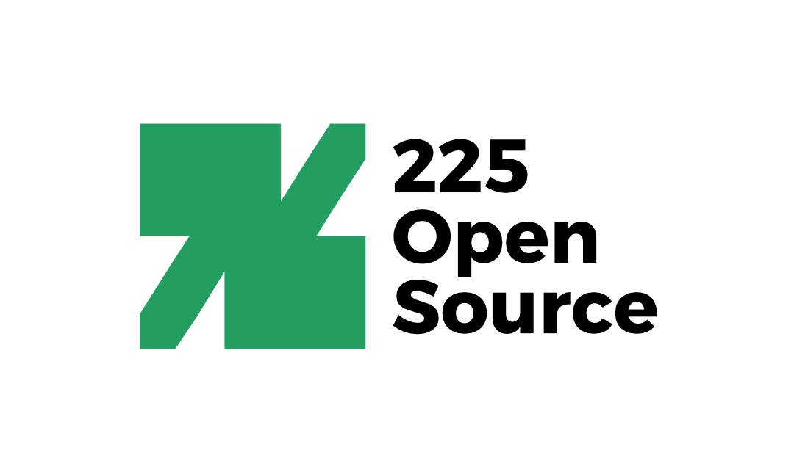

<div align="center">
  

  # 225 Open Source

  **The #1 Open Source Community Platform for Côte d'Ivoire**

  [](https://opensource.org/licenses/MIT)
  [](https://reactjs.org/)
  [](https://www.typescriptlang.org/)
  [](https://supabase.com/)

  [Live Demo](https://225os.com) • [Report Bug](https://github.com/princekouame/225_OS/issues) • [Request Feature](https://github.com/princekouame/225_OS/issues)
</div>

---

## À Propos du Projet

**225 Open Source** est une plateforme centralisée qui met en valeur les projets open source développés par des développeurs en Côte d'Ivoire. Bien que GitHub soit la plus grande plateforme open source au monde, il lui manque une fonctionnalité cruciale : **le filtrage des projets par pays**. C'est là que nous intervenons.

### Le Problème que Nous Résolvons

- **Pas de Filtre par Pays sur GitHub**: Impossible de découvrir facilement les projets open source créés par des développeurs ivoiriens
- **Visibilité Limitée**: Les talents ivoiriens restent cachés dans l'océan mondial des projets open source
- **Collaboration Fragmentée**: Difficile pour les développeurs ivoiriens de se trouver et de collaborer

### Notre Solution

- **Centralisation Intelligente**: Nous agrégeons les projets open source ivoiriens depuis GitHub
- **Filtrage par Pays**: Accès instantané à tous les projets open source créés en Côte d'Ivoire
- **Communauté Unifiée**: Un espace central pour découvrir, contribuer et collaborer avec les talents locaux

---

## Mises à Jour Récentes

### v2.1.0 — Mai 2026

#### Pages Publiques & Navigation
- **Page article publique** : Les articles partagés s'affichent sans header/footer pour les utilisateurs non connectés, avec un CTA "Rejoindre la communauté" en bas
- **Liens de retour** : Boutons "Retour" visibles sur toutes les pages de détail publiques (Pitch, Produit, Projet, Article) pour les visiteurs non connectés
- **Accès public élargi** : `/explore`, `/articles`, `/launchpad`, `/pitchhub` accessibles sans authentification

#### Recherche
- **SearchModal générique** : Composant réutilisable avec prop `type` (`'article'` | `'pitch'`) — chaque page n'indexe que son propre contenu
- **Barres de recherche redesignées** : Pleine largeur sous le header sur Articles et PitchHub, côte à côte avec le filtre sur PitchHub desktop
- **Placeholders explicites** : Textes descriptifs avec troncature sur mobile pour éviter le retour à la ligne
- **Images de couverture** : Les résultats de recherche d'articles affichent leur image de couverture

#### Dashboard & Admin
- **Design épuré** : Ombres (`shadow-sm`) supprimées des cartes stats, tableaux et conteneurs admin — conservation des borders légers
- **Liste articles scrollable** : Scroll horizontal sur mobile dans la gestion des articles pour éviter la condensation du contenu
- **Modal de prévisualisation** : Catégorie et temps de lecture empilés sur mobile, côte à côte sur desktop

#### Mobile UX
- **Boutons empilés** : Recherche et publication se stackent verticalement sur mobile (Articles, PitchHub)
- **Catégories scrollables** : Pills de catégories avec scroll horizontal forcé sur mobile
- **Responsive amélioré** : Ajustements de layout sur toutes les pages de détail et formulaires

#### Corrections
- **AuthModal** : Correction du bug de spinner infini après connexion réussie
- **Articles** : Affichage correct du nom et avatar de l'auteur (suppression de la colonne `username` inexistante)
- **Avatar upload** : Correction de la violation RLS Storage avec le chemin `userId/filename`
- **Edit Profile** : Suppression de la section changement de mot de passe, simplification de l'UI avatar
- **Profile page** : Intégration des composants `ProfileArticles` et `ProfilePitches`, suppression de la bannière

---

## Fonctionnalités

- **Découverte de Projets**: Parcourez et recherchez des projets open source de développeurs ivoiriens
- **225 Launchpad**: Découvrez et votez pour les meilleurs produits locaux, SaaS et applications
- **PitchHub**: Partagez vos idées de startup et trouvez des co-fondateurs, investisseurs ou leads techniques
- **Articles & DevBlog**: Tutoriels, tips, retours d'expérience et actualités tech partagés par la communauté
- **Open Source Day 2026**: Page dédiée à l'événement annuel open source ivoirien
- **Recherche Contextuelle**: Modals de recherche par type de contenu (articles, pitches, projets, produits)
- **Pages Publiques Immersives**: Pages de détail sans header/footer pour les visiteurs non connectés avec CTA d'engagement
- **Vitrine de Talents**: Découvrez et connectez-vous avec des développeurs ivoiriens et leur expertise
- **Système d'Annonces**: Restez informé des événements et promos de la communauté
- **Système de Dons**: Soutenez la plateforme et les initiatives open source locales
- **Filtrage Intelligent**: Filtrez les projets par technologie, catégorie et popularité
- **Profils Utilisateur**: Mettez en valeur vos projets, compétences et liens sociaux
- **Éditeur Markdown**: Rédaction d'articles avec preview en temps réel et gestion brouillon/publié
- **Mode Sombre**: Interface élégante avec thèmes clair et sombre (style GitHub)
- **Contrôle Admin Dynamique**: Mode maintenance et visibilité Open Source Day contrôlés depuis le dashboard
- **Authentification Sécurisée**: Propulsé par Supabase avec email et GitHub OAuth
- **Design Responsive**: Optimisé pour desktop, tablette et mobile

---


## 📚 Table des Matières

1. [Vue d'Architecture Globale](#1-vue-darchitecture-globale)
2. [Stack Technique](#2-stack-technique)
3. [Structure de la Base de Données](#3-structure-de-la-base-de-données)
4. [Authentification & Sécurité](#4-authentification--sécurité)
5. [Flux de Données Détaillés](#5-flux-de-données-détaillés)
6. [Architecture Frontend](#6-architecture-frontend)
7. [Fonctionnement par Cas d'Usage](#7-fonctionnement-par-cas-dusage)
8. [Configuration & Déploiement](#8-configuration--déploiement)
9. [About The Project](#9-about-the-project)
10. [Features](#10-features)
11. [Getting Started](#11-getting-started)
12. [Contributing](#12-contributing)
13. [License](#13-license)

---

## 1. Vue d'Architecture Globale

```
┌─────────────────────────────────────────────────────────────────────────────┐
│                          225 OS ARCHITECTURE                                │
├─────────────────────────────────────────────────────────────────────────────┤
│                                                                             │
│  ┌──────────────┐     ┌──────────────┐     ┌──────────────┐                │
│  │   Desktop    │     │   Mobile     │     │   Tablet     │                │
│  │   (Browser)  │◄────┤   (Browser)  │◄────┤   (Browser)  │                │
│  └──────┬───────┘     └──────┬───────┘     └──────┬───────┘                │
│         │                    │                    │                        │
│         └────────────────────┼────────────────────┘                        │
│                              │                                              │
│                              ▼                                              │
│  ┌─────────────────────────────────────────────────────────────────┐       │
│  │                     VERCEL (Hosting)                              │       │
│  │  ┌─────────────────────────────────────────────────────────┐   │       │
│  │  │              React SPA (Vite Build)                       │   │       │
│  │  │  ┌─────────┐  ┌─────────┐  ┌──────────┐  ┌─────────────┐  │   │       │
│  │  │  │  Pages  │  │Components│ │ Services │  │  Contexts   │  │   │       │
│  │  │  │  (22)   │  │  (25+)  │  │   (6)    │  │    (3)      │  │   │       │
│  │  │  │         │  │         │  │          │  │             │  │   │       │
│  │  │  │ Home    │  │ Navbar  │  │ project  │  │ AuthContext │  │   │       │
│  │  │  │ Explore │  │ Footer  │  │ launchpad│  │ ThemeContext│  │   │       │
│  │  │  │ Launchpad│ │ Cards   │  │ pitch    │  │ NotifContext│  │   │       │
│  │  │  │ PitchHub│  │ Modals  │  │ profile  │  └─────────────┘  │   │       │
│  │  │  │ Profile │  │ Layout  │  │ github   │                   │   │       │
│  │  │  │ Dashboard│ │         │  │ announce │                   │   │       │
│  │  │  └─────────┘  └─────────┘  └──────────┘                   │   │       │
│  │  └─────────────────────────────────────────────────────────┘   │       │
│  │                                                                 │       │
│  │  ┌─────────────────────────────────────────────────────────┐   │       │
│  │  │                 React Router DOM 6.x                      │   │       │
│  │  │  • 22 routes (public + protected + admin)               │   │       │
│  │  │  • SPA navigation with ScrollToTop                      │   │       │
│  │  │  • Maintenance mode toggle                              │   │       │
│  │  └─────────────────────────────────────────────────────────┘   │       │
│  └────────────────────────────────┬────────────────────────────────┘       │
│                                   │                                          │
│                                   ▼                                          │
│  ┌─────────────────────────────────────────────────────────────────┐       │
│  │                     SUPABASE (BaaS)                               │       │
│  │  ┌─────────────────────────────────────────────────────────┐   │       │
│  │  │              PostgreSQL Database                          │   │       │
│  │  │  ┌──────────┐  ┌──────────┐  ┌──────────┐  ┌──────────┐  │   │       │
│  │  │  │ profiles │  │ projects │  │ products │  │  pitches │  │   │       │
│  │  │  │──────────│  │──────────│  │──────────│  │──────────│  │   │       │
│  │  │  │ id (PK)  │  │ id (PK)  │  │ id (PK)  │  │ id (PK)  │  │   │       │
│  │  │  │ username │  │ name     │  │ name     │  │ project_ │  │   │       │
│  │  │  │ full_name│  │ author   │  │ tagline  │  │ name     │  │   │       │
│  │  │  │ avatar_  │  │ repo_url │  │ url      │  │ problem  │  │   │       │
│  │  │  │ url      │  │ stacks[] │  │ image_url│  │ pitch    │  │   │       │
│  │  │  │ bio      │  │ stars    │  │ maker_id │  │ need     │  │   │       │
│  │  │  │ headline │  │ forks    │  │ slug     │  │ email    │  │   │       │
│  │  │  │ location │  │ language │  │          │  │ slug     │  │   │       │
│  │  │  │ socials  │  │ slug     │  │          │  │          │  │   │       │
│  │  │  │ is_      │  │ user_id  │  │          │  │          │  │   │       │
│  │  │  │ approved │  │          │  │          │  │          │  │   │       │
│  │  │  └──────────┘  └──────────┘  └──────────┘  └──────────┘  │   │       │
│  │  │                                                           │   │       │
│  │  │  ┌──────────────┐  ┌──────────────┐                      │   │       │
│  │  │  │product_votes │  │announcements │                      │   │       │
│  │  │  │──────────────│  │──────────────│                      │   │       │
│  │  │  │ product_id   │  │ title        │                      │   │       │
│  │  │  │ user_id      │  │ description  │                      │   │       │
│  │  │  │              │  │ type         │                      │   │       │
│  │  │  │              │  │ is_active    │                      │   │       │
│  │  │  │              │  │ order_index  │                      │   │       │
│  │  │  └──────────────┘  └──────────────┘                      │   │       │
│  │  └─────────────────────────────────────────────────────────┘   │       │
│  │                                                                 │       │
│  │  ┌─────────────────────────────────────────────────────────┐   │       │
│  │  │              Supabase Storage                             │   │       │
│  │  │  • launchpad-images/ (product screenshots)               │   │       │
│  │  │  • profiles/ (avatars & banners)                         │   │       │
│  │  └─────────────────────────────────────────────────────────┘   │       │
│  │                                                                 │       │
│  │  ┌─────────────────────────────────────────────────────────┐   │       │
│  │  │              Auth (GoTrue)                                │   │       │
│  │  │  • JWT Token-based authentication                       │   │       │
│  │  │  • Email/password & OAuth (GitHub)                        │   │       │
│  │  │  • Auto-profile creation on signup                      │   │       │
│  │  │  • Admin approval system (is_approved flag)              │   │       │
│  │  └─────────────────────────────────────────────────────────┘   │       │
│  └─────────────────────────────────────────────────────────────────┘       │
│                                                                             │
└─────────────────────────────────────────────────────────────────────────────┘
```

### Points Clés de l'Architecture

- **Frontend**: React 18 + TypeScript + Vite (build ultra-rapide)
- **Backend-as-a-Service**: Supabase (PostgreSQL + Auth + Storage)
- **Authentification**: JWT tokens avec refresh automatique + vérification d'approbation
- **Sécurité**: Row Level Security (RLS) au niveau de la base de données
- **UI**: Tailwind CSS v4 (PostCSS plugin)
- **Icônes**: Lucide React
- **Routing**: React Router DOM 6 (22 routes)
- **Déploiement**: Vercel (SPA rewrites)

---

## 2. Stack Technique

### Frontend
| Technologie | Version | Rôle |
|-------------|---------|------|
| React | 18.2.0 | Framework UI |
| TypeScript | 5.8.2 | Typage statique |
| Vite | 6.2.0 | Build tool & Dev server |
| React Router DOM | 6.22.3 | Routing client-side (22 routes) |
| Tailwind CSS | 4.1.18 | Framework CSS (PostCSS plugin) |
| Lucide React | 0.344.0 | Icônes |

### Backend & Infrastructure
| Technologie | Rôle |
|-------------|------|
| Supabase | BaaS (Backend-as-a-Service) |
| PostgreSQL | Base de données relationnelle |
| GoTrue | Service d'authentification |
| PostgREST | API REST générée automatiquement |
| Supabase Storage | Stockage d'images (produits, profils) |
| Vercel | Hébergement & CDN |

### Outils de Développement
| Outil | Rôle |
|-------|------|
| PostCSS | Transformation CSS |
| Autoprefixer | Préfixes CSS automatiques |
| TypeScript | Compilation et typage |

---

## 3. Structure de la Base de Données

### Schéma Entité-Relation (ERD)

```
┌──────────────────────────────────────────────────────────────────────────────────┐
│                           DATABASE SCHEMA - 225 OS                               │
├──────────────────────────────────────────────────────────────────────────────────┤
│                                                                                  │
│  ┌──────────────────┐         ┌──────────────────┐                              │
│  │   auth.users     │         │    profiles      │                              │
│  │  (Supabase Auth) │◄────────┤  (Extension)     │                              │
│  ├──────────────────┤   1:1   ├──────────────────┤                              │
│  │ id (UUID) PK     │         │ id (UUID) PK/FK  │                              │
│  │ email            │         │ username         │                              │
│  │ encrypted_       │         │ full_name        │                              │
│  │ password         │         │ avatar_url       │                              │
│  │ user_metadata    │         │ banner_url       │                              │
│  └────────┬─────────┘         │ headline         │                              │
│           │                   │ bio              │                              │
│           │ 1:N               │ location         │                              │
│           ▼                   │ website          │                              │
│  ┌──────────────────┐         │ github           │                              │
│  │    projects      │         │ linkedin         │                              │
│  ├──────────────────┤         │ twitter          │                              │
│  │ id (UUID) PK     │         │ facebook         │                              │
│  │ user_id (FK) ────┼─────────┤ is_approved      │                              │
│  │ name             │         │ created_at       │                              │
│  │ author           │         └──────────────────┘                              │
│  │ description      │                                                         │
│  │ repo_url         │                                                         │
│  │ stacks (TEXT[])  │                                                         │
│  │ stars            │                                                         │
│  │ forks            │                                                         │
│  │ language         │                                                         │
│  │ updated_at       │                                                         │
│  │ image_url        │                                                         │
│  │ slug             │                                                         │
│  └──────────────────┘                                                         │
│                                                                                  │
│  ┌──────────────────┐         ┌──────────────────┐                           │
│  │    products      │         │  product_votes   │                           │
│  ├──────────────────┤         ├──────────────────┤                           │
│  │ id (UUID) PK     │         │ product_id (FK)  │                           │
│  │ maker_id (FK) ───┼─────────┤ user_id (FK)     │                           │
│  │ name             │ 1:N     └──────────────────┘                           │
│  │ tagline          │                                                          │
│  │ description      │                                                          │
│  │ url              │                                                          │
│  │ image_url        │                                                          │
│  │ slug             │                                                          │
│  │ contact_email    │                                                          │
│  │ app_store_url    │                                                          │
│  │ play_store_url   │                                                          │
│  │ created_at       │                                                          │
│  └──────────────────┘                                                         │
│                                                                                  │
│  ┌──────────────────┐         ┌──────────────────┐                           │
│  │     pitches      │         │  announcements   │                           │
│  ├──────────────────┤         ├──────────────────┤                           │
│  │ id (UUID) PK     │         │ id (UUID/INT) PK │                           │
│  │ user_id (FK)     │         │ title            │                           │
│  │ project_name     │         │ description      │                           │
│  │ problem          │         │ date             │                           │
│  │ pitch            │         │ location         │                           │
│  │ need             │         │ learn_more_url   │                           │
│  │ email            │         │ register_url     │                           │
│  │ location         │         │ order_index      │                           │
│  │ link             │         │ type (event/promo)│                          │
│  │ slug             │         │ tag              │                           │
│  │ created_at       │         │ image_url        │                           │
│  └──────────────────┘         │ is_active        │                           │
│                               │ created_at       │                           │
│                               └──────────────────┘                           │
│                                                                                  │
└──────────────────────────────────────────────────────────────────────────────────┘
```

### Description des Tables

#### 1. `profiles` (Extension du profil utilisateur)
```sql
CREATE TABLE public.profiles (
  id UUID PRIMARY KEY REFERENCES auth.users(id) ON DELETE CASCADE,
  email TEXT,
  username TEXT,
  full_name TEXT,
  avatar_url TEXT,
  banner_url TEXT,
  headline TEXT,
  bio TEXT,
  location TEXT,
  website TEXT,
  github TEXT,
  linkedin TEXT,
  twitter TEXT,
  facebook TEXT,
  is_approved BOOLEAN DEFAULT true,
  created_at TIMESTAMPTZ DEFAULT now()
);
```
**Rôle**: Stocke les informations de profil des utilisateurs. Créé automatiquement lors de la première connexion. Le flag `is_approved` permet aux admins de désactiver des comptes.

#### 2. `projects` (Projets Open Source)
```sql
CREATE TABLE public.projects (
  id UUID PRIMARY KEY DEFAULT gen_random_uuid(),
  user_id UUID REFERENCES auth.users(id),
  name TEXT NOT NULL,
  author TEXT,
  description TEXT,
  repo_url TEXT,
  stacks TEXT[],                     -- Array de technologies
  stars INTEGER DEFAULT 0,
  forks INTEGER DEFAULT 0,
  language TEXT,
  updated_at TIMESTAMPTZ,
  image_url TEXT,
  slug TEXT UNIQUE,
  created_at TIMESTAMPTZ DEFAULT now()
);
```
**Rôle**: Contient les projets GitHub soumis par les utilisateurs. Les métadonnées (stars, forks, language) sont synchronisées automatiquement via l'API GitHub.

#### 3. `products` (Produits Launchpad)
```sql
CREATE TABLE public.products (
  id UUID PRIMARY KEY DEFAULT gen_random_uuid(),
  maker_id UUID REFERENCES auth.users(id),
  name TEXT NOT NULL,
  tagline TEXT,
  description TEXT,
  url TEXT,
  image_url TEXT,
  slug TEXT UNIQUE,
  contact_email TEXT,
  app_store_url TEXT,
  play_store_url TEXT,
  created_at TIMESTAMPTZ DEFAULT now()
);
```
**Rôle**: Stocke les produits SaaS/apps soumis au Launchpad (style ProductHunt).

#### 4. `product_votes` (Votes Launchpad)
```sql
CREATE TABLE public.product_votes (
  product_id UUID REFERENCES public.products(id) ON DELETE CASCADE,
  user_id UUID REFERENCES auth.users(id) ON DELETE CASCADE,
  PRIMARY KEY (product_id, user_id)
);
```
**Rôle**: Table de jointure pour le système de vote communautaire. Un utilisateur ne peut voter qu'une fois par produit.

#### 5. `pitches` (Idées Startup - PitchHub)
```sql
CREATE TABLE public.pitches (
  id UUID PRIMARY KEY DEFAULT gen_random_uuid(),
  user_id UUID REFERENCES auth.users(id),
  project_name TEXT NOT NULL,
  problem TEXT,
  pitch TEXT,
  need TEXT,                         -- Co-fondateur, Investisseur, etc.
  email TEXT,
  location TEXT,
  link TEXT,
  slug TEXT UNIQUE,
  created_at TIMESTAMPTZ DEFAULT now()
);
```
**Rôle**: Stocke les idées de startup partagées dans le PitchHub pour faciliter le matchmaking.

#### 6. `articles` (Articles Techniques)
```sql
CREATE TABLE public.articles (
  id UUID PRIMARY KEY DEFAULT gen_random_uuid(),
  user_id UUID REFERENCES auth.users(id),
  title TEXT NOT NULL,
  category TEXT NOT NULL,
  image_url TEXT,
  summary TEXT NOT NULL,
  content TEXT NOT NULL,                    -- Markdown content
  tags TEXT[],                              -- Array de tags
  status TEXT CHECK (status IN ('draft', 'published')) DEFAULT 'published',
  slug TEXT UNIQUE,
  created_at TIMESTAMPTZ DEFAULT now(),
  updated_at TIMESTAMPTZ DEFAULT now()
);
```
**Rôle**: Stocke les articles techniques rédigés par les utilisateurs. Supporte le statut brouillon/publié et le contenu Markdown.

#### 7. `announcements` (Annonces)
```sql
CREATE TABLE public.announcements (
  id UUID PRIMARY KEY DEFAULT gen_random_uuid(),
  title TEXT NOT NULL,
  description TEXT,
  date TEXT,
  location TEXT,
  learn_more_url TEXT,
  register_url TEXT,
  order_index INTEGER DEFAULT 0,
  type TEXT CHECK (type IN ('event', 'promo')),
  tag TEXT,
  image_url TEXT,
  is_active BOOLEAN DEFAULT true,
  created_at TIMESTAMPTZ DEFAULT now()
);
```
**Rôle**: Annonces gérées par les admins (événements, promos). Deux types: `event` et `promo`.

#### 8. `site_settings` (Paramètres du Site)
```sql
CREATE TABLE public.site_settings (
  key TEXT PRIMARY KEY,
  value BOOLEAN NOT NULL DEFAULT true,
  updated_at TIMESTAMPTZ DEFAULT now()
);
```
**Rôle**: Stocke les paramètres dynamiques du site contrôlés depuis le dashboard admin.

| Clé | Valeur par défaut | Description |
|-----|-------------------|-------------|
| `show_opensource_day` | `true` | Affiche/masque l'onglet Open Source Day dans la navigation |
| `maintenance_mode` | `false` | Active/désactive le mode maintenance pour tout le site |

**Fonctionnement**: L'application charge ces paramètres au démarrage et les rafraîchit toutes les 30 secondes. Le toggle maintenance mode permet de mettre le site en maintenance sans modifier le code.

### Supabase Storage Buckets

| Bucket | Usage | Limite |
|--------|-------|--------|
| `launchpad-images` | Screenshots/logos produits | 2MB par fichier |
| `profiles` | Avatars et bannières utilisateurs | 500KB avatar, 1MB banner |

---

## 4. Authentification & Sécurité

### Architecture d'Authentification

```
┌─────────────────────────────────────────────────────────────────────────────┐
│                         AUTHENTIFICATION FLOW                               │
├─────────────────────────────────────────────────────────────────────────────┤
│                                                                             │
│  ┌──────────────┐          ┌──────────────────┐          ┌──────────────┐  │
│  │    User      │          │   AuthContext    │          │  Supabase    │  │
│  │   (Browser)  │          │   (React)        │          │   Auth       │  │
│  └──────┬───────┘          └────────┬─────────┘          └──────┬───────┘  │
│         │                           │                          │          │
│         │  1. Login/Signup          │                          │          │
│         │──────────────────────────►│                          │          │
│         │                           │  2. Auth Request         │          │
│         │                           │─────────────────────────►│          │
│         │                           │                          │          │
│         │                           │  3. JWT Token + Session  │          │
│         │                           │◄─────────────────────────│          │
│         │                           │                          │          │
│         │                           │  4. Check Profile        │          │
│         │                           │────┐                     │          │
│         │                           │    │ SELECT is_approved  │          │
│         │                           │◄───┘ FROM profiles       │          │
│         │                           │                          │          │
│         │                           │  5a. If !approved        │          │
│         │                           │     → signOut + warning  │          │
│         │                           │                          │          │
│         │                           │  5b. If no profile       │          │
│         │                           │     → INSERT profile     │          │
│         │                           │                          │          │
│         │  6. App State Updated     │                          │          │
│         │◄──────────────────────────│                          │          │
│         │                           │                          │          │
│         │  7. subscribe()           │                          │          │
│         │     onAuthStateChange     │                          │          │
│         │──────────────────────────►│                          │          │
│         │                           │                          │          │
└─────────┴───────────────────────────┴──────────────────────────┴──────────┘
```

### Fonctionnalités de Sécurité

#### Row Level Security (RLS)

Supabase utilise PostgreSQL RLS pour sécuriser l'accès aux données:

| Table | Opération | Qui | Condition |
|-------|-----------|-----|-----------|
| **profiles** | SELECT | Public | `is_approved = true` |
| | INSERT/UPDATE | Owner | `auth.uid() = id` |
| **projects** | SELECT | Public | `true` |
| | INSERT/UPDATE/DELETE | Owner | `auth.uid() = user_id` |
| **products** | SELECT | Public | `true` |
| | INSERT/UPDATE/DELETE | Maker | `auth.uid() = maker_id` |
| **product_votes** | INSERT/DELETE | Authenticated | `auth.uid() = user_id` |
| **pitches** | SELECT | Public | `true` |
| | INSERT/UPDATE/DELETE | Owner | `auth.uid() = user_id` |
| **articles** | SELECT | Public | `status = 'published'` |
| | INSERT/UPDATE/DELETE | Owner | `auth.uid() = user_id` |
| **announcements** | SELECT | Public | `is_active = true` |
| | ALL | Admin | Email = `princekouame7@gmail.com` |
| **site_settings** | SELECT | Public | `true` |
| | INSERT/UPDATE | Authenticated | `auth.role() = 'authenticated'` |

#### Protection des Routes

| Type de Route | Exemples | Protection |
|---------------|----------|------------|
| **Public** | Home, Launchpad, PitchHub, Profile | Aucune |
| **Authentifié** | Explore, Dashboard, AddProject, SubmitProduct | `user !== null` |
| **Admin** | AdminAnnouncements | Email = `princekouame7@gmail.com` |

#### Gestion des Tokens

```typescript
// src/utils/supabaseUtils.ts
// Robuste token getter avec fallback localStorage
export const getAuthToken = async (): Promise<string | null> => {
  // 1. Essayer via le client Supabase
  // 2. Fallback: parser localStorage (sb-*-auth-token)
  // 3. Retourner null si tout échoue
};
```

#### Timeout de Sécurité

L'authentification implémente des timeouts pour éviter le loading infini:
- **Init session**: 1 seconde max
- **Sign out**: 1 seconde max + nettoyage manuel du localStorage
- **Upload d'image**: 15 secondes avec AbortController

---

## 5. Flux de Données Détaillés

### 5.1 Ajout d'un Projet GitHub (Add Project)

```
┌──────────────────────────────────────────────────────────────────────────────────┐
│                         ADD PROJECT FLOW                                         │
├──────────────────────────────────────────────────────────────────────────────────┤
│                                                                                  │
│  AddProject.tsx                                                                  │
│       │                                                                          │
│       ▼                                                                          │
│  ┌─────────────────────────────────────────┐                                    │
│  │ 1. User paste GitHub repo URL           │                                    │
│  │    e.g. https://github.com/user/repo    │                                    │
│  └────────┬────────────────────────────────┘                                    │
│           │                                                                      │
│           ▼                                                                      │
│  ┌─────────────────────────────────────────┐                                    │
│  │ 2. githubService.extractRepoInfo(url)   │                                    │
│  │    → { owner: 'user', repo: 'repo' }    │                                    │
│  └────────┬────────────────────────────────┘                                    │
│           │                                                                      │
│           ▼                                                                      │
│  ┌─────────────────────────────────────────┐                                    │
│  │ 3. githubService.fetchGithubMetadata()  │                                    │
│  │                                         │                                    │
│  │    GET https://api.github.com/repos/    │                                    │
│  │        {owner}/{repo}                   │                                    │
│  │                                         │                                    │
│  │    Returns:                             │                                    │
│  │    ├─ name, owner.login                 │                                    │
│  │    ├─ description                       │                                    │
│  │    ├─ stargazers_count, forks_count     │                                    │
│  │    ├─ language, updated_at              │                                    │
│  │    └─ html_url, owner.avatar_url        │                                    │
│  └────────┬────────────────────────────────┘                                    │
│           │                                                                      │
│           ▼                                                                      │
│  ┌─────────────────────────────────────────┐                                    │
│  │ 4. Form auto-filled with GitHub data    │                                    │
│  │    User adds:                           │                                    │
│  │    ├─ Tech stack tags (select/custom)   │                                    │
│  │    └─ Review/edit description           │                                    │
│  └────────┬────────────────────────────────┘                                    │
│           │                                                                      │
│           ▼                                                                      │
│  ┌─────────────────────────────────────────┐                                    │
│  │ 5. projectService.addProject()          │                                    │
│  │                                         │                                    │
│  │    ├─ slugify(name) → unique slug       │                                    │
│  │    ├─ POST /rest/v1/projects            │                                    │
│  │    ├─ Headers: apikey + Bearer token    │                                    │
│  │    └─ Body: all project fields          │                                    │
│  └────────┬────────────────────────────────┘                                    │
│           │                                                                      │
│           ▼                                                                      │
│  ┌─────────────────────────────────────────┐                                    │
│  │ 6. Redirect to /explore or /dashboard   │                                    │
│  │    Toast notification: "Project added!" │                                    │
│  └───────────────────────────────────────────┘                                    │
│                                                                                  │
└──────────────────────────────────────────────────────────────────────────────────┘
```

### 5.2 Vote sur un Produit Launchpad

```
┌──────────────────────────────────────────────────────────────────────────────────┐
│                         VOTE FLOW (Optimistic UI)                                │
├──────────────────────────────────────────────────────────────────────────────────┤
│                                                                                  │
│  ProductCard.tsx                                                                 │
│       │                                                                          │
│       ▼                                                                          │
│  ┌─────────────────────────────────────────┐                                    │
│  │ 1. User clicks "Upvote" button          │                                    │
│  └────────┬────────────────────────────────┘                                    │
│           │                                                                      │
│           ▼                                                                      │
│  ┌─────────────────────────────────────────┐                                    │
│  │ 2. Optimistic UI update                 │                                    │
│  │    ├─ votes_count++ (immediate)         │                                    │
│  │    ├─ has_voted = true                  │                                    │
│  │    └─ Button style changes (filled)     │                                    │
│  └────────┬────────────────────────────────┘                                    │
│           │                                                                      │
│           ▼                                                                      │
│  ┌─────────────────────────────────────────┐                                    │
│  │ 3. launchpadService.toggleVote()        │                                    │
│  │                                         │                                    │
│  │    if (isCurrentlyVoted):               │                                    │
│  │      DELETE /rest/v1/product_votes      │                                    │
│  │        ?product_id=eq.{id}              │                                    │
│  │        &user_id=eq.{userId}             │                                    │
│  │    else:                                │                                    │
│  │      POST /rest/v1/product_votes        │                                    │
│  │        Body: { product_id, user_id }    │                                    │
│  └────────┬────────────────────────────────┘                                    │
│           │                                                                      │
│           ▼                                                                      │
│  ┌─────────────────────────────────────────┐                                    │
│  │ 4. Success: Keep optimistic state       │                                    │
│  │    Error: Rollback UI to previous state │                                    │
│  │    Toast notification on error          │                                    │
│  └───────────────────────────────────────────┘                                    │
│                                                                                  │
└──────────────────────────────────────────────────────────────────────────────────┘
```

### 5.3 Synchronisation des Stats GitHub

```
┌──────────────────────────────────────────────────────────────────────────────────┐
│                         GITHUB SYNC FLOW                                         │
├──────────────────────────────────────────────────────────────────────────────────┤
│                                                                                  │
│  ProjectDetails.tsx (on mount)                                                   │
│       │                                                                          │
│       ▼                                                                          │
│  ┌─────────────────────────────────────────┐                                    │
│  │ 1. Fetch project from DB                │                                    │
│  │    getProjectBySlug(slug)               │                                    │
│  └────────┬────────────────────────────────┘                                    │
│           │                                                                      │
│           ▼                                                                      │
│  ┌─────────────────────────────────────────┐                                    │
│  │ 2. Background sync (non-blocking)       │                                    │
│  │    projectService.syncProjectStats()    │                                    │
│  └────────┬────────────────────────────────┘                                    │
│           │                                                                      │
│           ▼                                                                      │
│  ┌─────────────────────────────────────────┐                                    │
│  │ 3. fetchGithubMetadata(repo_url)        │                                    │
│  │    → { stars, forks, updated_at }       │                                    │
│  └────────┬────────────────────────────────┘                                    │
│           │                                                                      │
│           ▼                                                                      │
│  ┌─────────────────────────────────────────┐                                    │
│  │ 4. Compare with local values            │                                    │
│  │    if (stars !== local.stars ||         │                                    │
│  │        forks !== local.forks) {         │                                    │
│  │                                         │                                    │
│  │      PATCH /rest/v1/projects            │                                    │
│  │        ?id=eq.{id}                      │                                    │
│  │        Body: { stars, forks,            │                                    │
│  │                updated_at }             │                                    │
│  │    }                                    │                                    │
│  └────────┬────────────────────────────────┘                                    │
│           │                                                                      │
│           ▼                                                                      │
│  ┌─────────────────────────────────────────┐                                    │
│  │ 5. DB updated silently                  │                                    │
│  │    User sees fresh stats on next visit  │                                    │
│  │    Errors are logged, not shown to user │                                    │
│  └───────────────────────────────────────────┘                                    │
│                                                                                  │
└──────────────────────────────────────────────────────────────────────────────────┘
```

### 5.4 Dashboard - Agrégation des Statistiques

```
┌──────────────────────────────────────────────────────────────────────────────────┐
│                         DASHBOARD STATS FLOW                                     │
├──────────────────────────────────────────────────────────────────────────────────┤
│                                                                                  │
│  Dashboard.tsx                                                                   │
│       │                                                                          │
│       ▼                                                                          │
│  ┌─────────────────────────────────────────┐                                    │
│  │ 1. useEffect on mount                   │                                    │
│  │    if (user) fetch all user data        │                                    │
│  └────────┬────────────────────────────────┘                                    │
│           │                                                                      │
│           ▼                                                                      │
│  ┌─────────────────────────────────────────┐                                    │
│  │ 2. Parallel fetches:                    │                                    │
│  │    ├─ getUserProjects(userId)           │                                    │
│  │    ├─ getUserLaunchpadProducts(userId)  │                                    │
│  └────────┬────────────────────────────────┘                                    │
│           │                                                                      │
│           ▼                                                                      │
│  ┌─────────────────────────────────────────┐                                    │
│  │ 3. Compute aggregated stats:            │                                    │
│  │    ├─ totalProjects = projects.length   │                                    │
│  │    ├─ totalProducts = products.length   │                                    │
│  │    ├─ totalStars = sum(p.stars)         │                                    │
│  │    ├─ totalForks = sum(p.forks)         │                                    │
│  │    └─ totalVotes = sum(p.votes_count)   │                                    │
│  └────────┬────────────────────────────────┘                                    │
│           │                                                                      │
│           ▼                                                                      │
│  ┌─────────────────────────────────────────┐                                    │
│  │ 4. Render:                              │                                    │
│  │    ├─ Stats cards (5 metrics)           │                                    │
│  │    ├─ Paginated projects list           │                                    │
│  │    ├─ Quick action buttons              │                                    │
│  │    └─ WhatsApp community banner         │                                    │
│  └───────────────────────────────────────────┘                                    │
│                                                                                  │
└──────────────────────────────────────────────────────────────────────────────────┘
```

---

## 6. Architecture Frontend

### Structure des Dossiers

```
225_OS/
├── src/
│   ├── components/          # Composants réutilisables
│   │   ├── Layout.tsx           # Shell avec Nav/Footer conditionnels
│   │   ├── Navbar.tsx           # Navigation principale (desktop + mobile)
│   │   ├── Footer.tsx           # Footer avec liens
│   │   ├── AuthModal.tsx        # Modal Login/Signup/Forgot password
│   │   ├── SearchModal.tsx      # Modal de recherche générique (type: article/pitch)
│   │   ├── SearchModalPublic.tsx # Modal de recherche projets (public)
│   │   ├── ProjectCard.tsx      # Carte projet GitHub
│   │   ├── Badge.tsx            # Badge technologie
│   │   ├── Pagination.tsx       # Contrôles de pagination
│   │   ├── Toast.tsx            # Notification individuelle
│   │   ├── ToastContainer.tsx   # Gestionnaire de notifications
│   │   ├── ConfirmModal.tsx     # Dialogue de confirmation
│   │   ├── ScrollToTop.tsx      # Reset scroll on navigate
│   │   ├── MarkdownEditor.tsx   # Éditeur Markdown avec preview
│   │   ├── AnnouncementManager.tsx # Admin CRUD announcements
│   │   ├── Launchpad/
│   │   │   ├── ProductCard.tsx      # Carte produit avec vote
│   │   │   ├── ProductGrid.tsx      # Grille de produits
│   │   │   └── ProductSearchModal.tsx # Recherche Launchpad
│   │   └── Profile/
│   │       ├── ProfileHeader.tsx    # Bannière, avatar, socials
│   │       ├── ProfileAbout.tsx     # Section bio
│   │       ├── ProfileProjects.tsx  # Projets de l'utilisateur
│   │       ├── ProfileLaunchpad.tsx # Produits Launchpad
│   │       ├── ProfileArticles.tsx  # Articles de l'utilisateur
│   │       ├── ProfilePitches.tsx   # Pitches de l'utilisateur
│   │       └── ProfileEditForm.tsx  # Formulaire d'édition
│   │
│   ├── contexts/            # Context React (Global State)
│   │   ├── AuthContext.tsx        # État d'authentification
│   │   ├── ThemeContext.tsx       # Dark/light mode
│   │   └── NotificationContext.tsx # Système de toast
│   │
│   ├── lib/                 # Configuration
│   │   └── supabaseClient.ts      # Client Supabase
│   │
│   ├── services/            # Logique métier & API
│   │   ├── projectService.ts      # CRUD projects + GitHub sync
│   │   ├── launchpadService.ts    # CRUD products + votes + uploads
│   │   ├── pitchService.ts        # CRUD pitches
│   │   ├── profileService.ts      # CRUD profiles + image uploads
│   │   ├── githubService.ts       # GitHub API metadata fetching
│   │   └── announcementService.ts # CRUD announcements
│   │
│   ├── pages/               # Pages (Routes)
│   │   ├── Home.tsx               # Landing page
│   │   ├── Explore.tsx            # Browse projects (public)
│   │   ├── Launchpad.tsx          # Product showcase (trending/new)
│   │   ├── PitchHub.tsx           # Startup ideas hub
│   │   ├── Articles.tsx           # Browse articles (public)
│   │   ├── MyArticles.tsx         # Manage my articles (CRUD + Markdown)
│   │   ├── ArticleDetails.tsx     # Article detail page
│   │   ├── OpenSourceDay.tsx      # Annual event page
│   │   ├── Dashboard.tsx          # User dashboard with stats
│   │   ├── Profile.tsx            # Public user profile
│   │   ├── AddProject.tsx         # Add GitHub project form
│   │   ├── EditProject.tsx        # Edit project form
│   │   ├── SubmitProduct.tsx      # Submit/edit Launchpad product
│   │   ├── SubmitPitch.tsx        # Submit/edit pitch
│   │   ├── ProductPage.tsx        # Product detail page
│   │   ├── PitchDetails.tsx       # Pitch detail page
│   │   ├── ProjectDetails.tsx     # Project detail page
│   │   ├── EditProfile.tsx        # Edit user profile
│   │   ├── AdminAnnouncements.tsx # Admin announcement management
│   │   ├── Why225OpenSource.tsx   # Mission/vision page
│   │   ├── PrivacyPolicy.tsx      # Privacy policy
│   │   ├── Contact.tsx            # Contact page
│   │   ├── Donation.tsx           # Donation page (Wave + BMC)
│   │   ├── ResetPassword.tsx      # Password reset
│   │   └── MaintenancePage.tsx    # Maintenance mode page
│   │
│   ├── utils/               # Utilitaires
│   │   ├── supabaseUtils.ts       # Robust auth token getter
│   │   └── slugify.ts             # URL-safe slug generation
│   │
│   ├── types.ts             # TypeScript interfaces
│   ├── App.tsx              # Router & Providers
│   ├── config.ts            # App config (maintenance toggle)
│   ├── index.css            # Global styles (Tailwind)
│   └── index.tsx            # Entry point
│
├── public/                  # Static assets
│   ├── Brand/               # Banners & logos
│   ├── Contributors/        # Contributor headshots
│   └── Services/            # Payment QR codes & logos
│
├── .github/workflows/       # GitHub Actions
│   └── keep-supabase-alive.yml  # Cron to keep Supabase free tier alive
│
├── package.json
├── vite.config.ts
├── tsconfig.json
├── vercel.json
└── README.md
```

### Flux de Données Frontend

```
┌──────────────────────────────────────────────────────────────────────────────────┐
│                      FRONTEND DATA FLOW                                          │
├──────────────────────────────────────────────────────────────────────────────────┤
│                                                                                  │
│  ┌─────────────────────────────────────────────────────────────────────────┐  │
│  │                           Contexts (Global State)                         │  │
│  │  ┌───────────────┐  ┌───────────────┐  ┌─────────────────────────────┐  │  │
│  │  │  AuthContext  │  │ ThemeContext  │  │  NotificationContext        │  │  │
│  │  │  ───────────  │  │ ───────────   │  │  ─────────────────          │  │  │
│  │  │  session      │  │ theme: dark/  │  │  addNotification()          │  │  │
│  │  │  user         │  │   light       │  │  notifications[]            │  │  │
│  │  │  loading      │  │ toggleTheme() │  │  Types: success/warning/    │  │  │
│  │  │  signOut()    │  │               │  │    error                    │  │  │
│  │  └───────┬───────┘  └───────┬───────┘  └─────────────────────────────┘  │  │
│  │          │                  │                                            │  │
│  │          └──────────────────┘                                            │  │
│  │                     │                                                    │  │
│  └─────────────────────┼────────────────────────────────────────────────────┘  │
│                        │                                                        │
│                        ▼                                                        │
│  ┌─────────────────────────────────────────────────────────────────────────┐   │
│  │                          Pages (React Components)                       │   │
│  │                                                                         │   │
│  │   Home        Explore      Launchpad     PitchHub     Dashboard        │   │
│  │      │           │             │            │             │             │   │
│  │      ▼           ▼             ▼            ▼             ▼             │   │
│  │   ┌──────┐   ┌──────┐     ┌────────┐   ┌───────┐   ┌────────┐         │   │
│  │   │Static│   │Project│    │Product │   │ Pitch │   │ Stats  │         │   │
│  │   │Contenu│  │Cards │    │Grid +  │   │ Cards │   │ Cards  │         │   │
│  │   │       │   │Filters│   │ Vote   │   │ Filter│   │ Project│         │   │
│  │   └──────┘   └──────┘     └────────┘   └───────┘   └────────┘         │   │
│  │                                                                         │   │
│  └──────────────────────────────┬────────────────────────────────────────┘   │
│                                   │                                             │
│                                   ▼                                             │
│  ┌─────────────────────────────────────────────────────────────────────────┐  │
│  │                         Data Layer (src/services/)                      │  │
│  │                                                                         │  │
│  │   ┌──────────┐  ┌──────────┐  ┌──────────┐  ┌──────────┐               │  │
│  │   │ project  │  │launchpad │  │  pitch   │  │ profile  │               │  │
│  │   │ Service  │  │ Service  │  │ Service  │  │ Service  │               │  │
│  │   └────┬─────┘  └────┬─────┘  └────┬─────┘  └────┬─────┘               │  │
│  │        │             │             │             │                      │  │
│  │        └─────────────┴─────────────┴─────────────┘                      │  │
│  │                              │                                        │  │
│  │                              ▼                                        │  │
│  │   ┌─────────────────────────────────────────────────────────────────┐  │  │
│  │   │              Supabase REST API (PostgREST)                      │  │  │
│  │   │  fetch(`${url}/rest/v1/projects?select=*&order=...`)            │  │  │
│  │   │  Headers: apikey + Authorization: Bearer <token>                │  │  │
│  │   └─────────────────────────────────────────────────────────────────┘  │  │
│  │                                                                         │  │
│  └─────────────────────────────────────────────────────────────────────────┘  │
│                                                                                  │
└──────────────────────────────────────────────────────────────────────────────────┘
```

### Routing (26 Routes)

| Path | Page | Auth | Description |
|------|------|------|-------------|
| `/` | Home | Non | Landing page avec hero, features, CTA |
| `/explore` | Explore | Non | Browse projects avec filtres et recherche |
| `/launchpad` | Launchpad | Non | Showcase produits (Trending/New) |
| `/launchpad/submit` | SubmitProduct | Oui | Formulaire soumission produit |
| `/launchpad/edit/:slug` | SubmitProduct | Oui | Édition produit existant |
| `/launchpad/p/:slug` | ProductPage | Non | Page détail produit (immersive si non connecté) |
| `/pitchhub` | PitchHub | Non | Browse idées startup |
| `/pitchhub/submit` | SubmitPitch | Oui | Formulaire soumission pitch |
| `/pitchhub/edit/:slug` | SubmitPitch | Oui | Édition pitch existant |
| `/pitchhub/p/:slug` | PitchDetails | Non | Page détail pitch (immersive si non connecté) |
| `/articles` | Articles | Non | Browse articles techniques |
| `/articles/:slug` | ArticleDetails | Non | Page détail article (immersive si non connecté) |
| `/my-articles` | MyArticles | Oui | Gestion de mes articles (CRUD + Markdown) |
| `/add` | AddProject | Oui | Ajouter projet GitHub |
| `/dashboard` | Dashboard | Oui | Tableau de bord utilisateur |
| `/edit-profile` | EditProfile | Oui | Éditer profil |
| `/edit/:slug` | EditProject | Oui | Éditer projet |
| `/profile/:id` | Profile | Non | Profil public utilisateur |
| `/project/:slug` | ProjectDetails | Non | Détail projet (toujours immersif) |
| `/why` | Why225OpenSource | Non | Mission et vision |
| `/privacy` | PrivacyPolicy | Non | Politique de confidentialité |
| `/contact` | Contact | Non | Page contact |
| `/donate` | Donation | Non | Dons (Wave + Buy Me A Coffee) |
| `/reset-password` | ResetPassword | Non | Réinitialisation mot de passe |
| `/admin/announcements` | AdminAnnouncements | Admin | Gestion annonces et paramètres site |
| `/opensource-day` | OpenSourceDay | Non | Page événement annuel |

---

## 7. Fonctionnement par Cas d'Usage

### 7.1 Inscription et Connexion

```
┌──────────────────────────────────────────────────────────────────────────────┐
│                        SIGNUP/LOGIN FLOW                                     │
├──────────────────────────────────────────────────────────────────────────────┤
│                                                                              │
│  1. User clicks "Sign Up" in AuthModal                                       │
│                                                                              │
│  2. Fills: email, password                                                   │
│                                                                              │
│  3. supabase.auth.signUp({ email, password })                                │
│                                                                              │
│  4. Supabase Auth creates user in auth.users                                │
│                                                                              │
│  5. AuthContext detects SIGNED_IN event                                     │
│                                                                              │
│  6. checkUserProfile(user.id) called:                                       │
│     ├─ SELECT is_approved FROM profiles WHERE id = user.id                  │
│     ├─ If profile exists && !is_approved → signOut + warning                │
│     └─ If no profile → INSERT profile (is_approved: true)                   │
│                                                                              │
│  7. User is now authenticated and approved by default                       │
│                                                                              │
│  GitHub OAuth Flow:                                                          │
│  1. User clicks "Continue with GitHub"                                      │
│  2. Redirect to GitHub OAuth consent screen                                 │
│  3. GitHub redirects back with code                                         │
│  4. Supabase exchanges code for session                                     │
│  5. Same profile check logic as above                                       │
│                                                                              │
└──────────────────────────────────────────────────────────────────────────────┘
```

### 7.2 Soumission d'un Projet GitHub

```
┌──────────────────────────────────────────────────────────────────────────────┐
│                        ADD PROJECT FLOW                                      │
├──────────────────────────────────────────────────────────────────────────────┤
│                                                                              │
│  1. Authenticated user visits /add                                           │
│                                                                              │
│  2. Pastes GitHub repo URL                                                   │
│     e.g. https://github.com/user/my-project                                  │
│                                                                              │
│  3. githubService.extractRepoInfo(url) parses:                               │
│     ├─ owner: 'user'                                                         │
│     └─ repo: 'my-project'                                                    │
│                                                                              │
│  4. githubService.fetchGithubMetadata(url) calls:                            │
│     GET https://api.github.com/repos/user/my-project                         │
│                                                                              │
│  5. Auto-fills form with:                                                    │
│     ├─ Name: my-project                                                      │
│     ├─ Author: user                                                          │
│     ├─ Description: (from GitHub)                                            │
│     ├─ Stars: 42                                                             │
│     ├─ Forks: 7                                                              │
│     ├─ Language: TypeScript                                                  │
│     └─ Image: og:image from repo                                             │
│                                                                              │
│  6. User adds tech stack tags:                                               │
│     ├─ Select from suggested list (React, Python, etc.)                      │
│     └─ Or type custom tag + Enter                                            │
│                                                                              │
│  7. Submits form → projectService.addProject():                              │
│     ├─ slugify(name) → 'my-project'                                          │
│     ├─ POST /rest/v1/projects                                                │
│     └─ Body: { name, author, description, repo_url, stacks,                  │
│                stars, forks, language, updated_at, image_url,                │
│                slug, user_id }                                               │
│                                                                              │
│  8. Redirect to /explore with success toast                                  │
│                                                                              │
└──────────────────────────────────────────────────────────────────────────────┘
```

### 7.3 Vote sur un Produit Launchpad

```
┌──────────────────────────────────────────────────────────────────────────────┐
│                        VOTING FLOW                                           │
├──────────────────────────────────────────────────────────────────────────────┤
│                                                                              │
│  1. User visits /launchpad                                                   │
│                                                                              │
│  2. Sees product cards with upvote buttons                                   │
│                                                                              │
│  3. Clicks upvote → Optimistic UI update:                                    │
│     ├─ votes_count++ immediately                                             │
│     ├─ Button fills with color                                               │
│     └─ Product may reorder in Trending tab                                   │
│                                                                              │
│  4. Background: launchpadService.toggleVote():                               │
│     ├─ If already voted → DELETE from product_votes                          │
│     └─ If not voted → INSERT into product_votes                              │
│                                                                              │
│  5. On error → Rollback UI + error toast                                     │
│                                                                              │
│  Products are sorted by:                                                     │
│  ├─ Trending tab: votes_count DESC                                           │
│  └─ New tab: created_at DESC                                                 │
│                                                                              │
└──────────────────────────────────────────────────────────────────────────────┘
```

### 7.4 PitchHub - Partage d'Idées

```
┌──────────────────────────────────────────────────────────────────────────────┐
│                        PITCH SUBMISSION FLOW                                 │
├──────────────────────────────────────────────────────────────────────────────┤
│                                                                              │
│  1. Authenticated user visits /pitchhub/submit                               │
│                                                                              │
│  2. Fills form:                                                              │
│     ├─ Project Name (required)                                               │
│     ├─ Problem being solved (300 chars max)                                  │
│     ├─ The Pitch (500 chars max)                                             │
│     ├─ Need type (dropdown):                                                 │
│     │   Co-fondateur, Latefounder, Investisseur, Lead Technique,             │
│     │   Mentor/Conseils, Associé, Acheteur                                   │
│     ├─ Contact email                                                         │
│     ├─ Location                                                              │
│     └─ Optional link                                                         │
│                                                                              │
│  3. Submits → pitchService.addPitch():                                       │
│     ├─ slugify(project_name)                                                 │
│     └─ POST /rest/v1/pitches                                                 │
│                                                                              │
│  4. Pitch appears in /pitchhub list                                          │
│                                                                              │
│  5. Other users can:                                                         │
│     ├─ Filter by need type                                                   │
│     ├─ Search by text                                                        │
│     └─ Click to view details and contact via email                           │
│                                                                              │
└──────────────────────────────────────────────────────────────────────────────┘
```

### 7.5 Profils Utilisateurs

```
┌──────────────────────────────────────────────────────────────────────────────┐
│                        PROFILE FLOW                                          │
├──────────────────────────────────────────────────────────────────────────────┤
│                                                                              │
│  Public Profile (/profile/:id):                                              │
│  1. Anyone can visit a user's profile                                        │
│  2. Displays:                                                                │
│     ├─ Banner image + Avatar                                                 │
│     ├─ Full name, username, headline                                         │
│     ├─ Bio, location, website                                                │
│     ├─ Social links (GitHub, LinkedIn, Twitter, Facebook)                    │
│     ├─ User's GitHub projects                                                │
│     └─ User's Launchpad products                                             │
│                                                                              │
│  Edit Profile (/edit-profile):                                               │
│  1. Authenticated user visits /edit-profile                                  │
│  2. Loads current profile data                                               │
│  3. Can upload:                                                              │
│     ├─ Avatar (500KB max) → Supabase Storage: profiles/                      │
│     └─ Banner (1MB max) → Supabase Storage: profiles/                        │
│  4. Updates all fields → profileService.updateProfile()                      │
│     └─ Upsert: INSERT ... ON CONFLICT (id) DO UPDATE                        │
│                                                                              │
└──────────────────────────────────────────────────────────────────────────────┘
```

---

## 8. Configuration & Déploiement

### Variables d'Environnement

Créer un fichier `.env.local` à la racine:

```env
# Supabase Configuration
VITE_SUPABASE_URL=https://your-project.supabase.co
VITE_SUPABASE_ANON_KEY=your-anon-key
```

### Installation

```bash
# 1. Cloner le projet
git clone https://github.com/kouame09/225_OS
cd 225_OS

# 2. Installer les dépendances
npm install

# 3. Configurer les variables d'environnement
cp .env.example .env.local
# Éditer .env.local avec vos credentials Supabase

# 4. Lancer en mode développement
npm run dev

# 5. Build pour production
npm run build
```

### Configuration Supabase

1. Créer un projet sur [supabase.com](https://supabase.com)
2. Créer les tables dans le Dashboard > SQL Editor:
   - `profiles`, `projects`, `products`, `product_votes`, `pitches`, `announcements`, `site_settings`
3. Activer l'authentification Email et GitHub OAuth dans Auth > Providers
4. Créer les buckets Storage:
   - `launchpad-images` (public, 2MB max)
   - `profiles` (public, 1MB max)
5. Configurer les politiques RLS pour chaque table
6. Configurer les URLs de redirection:
   - Site URL: `http://localhost:3000` (dev) ou `https://225os.com` (prod)
   - Additional Redirect URLs: pour le reset password et OAuth

### Configuration Vercel

Le fichier `vercel.json` configure les rewrites SPA:

```json
{
  "rewrites": [
    { "source": "/(.*)", "destination": "/index.html" }
  ]
}
```

### Mode Maintenance (Dynamique)

Le mode maintenance est désormais contrôlé dynamiquement depuis le dashboard admin, plus besoin de modifier le code :

1. Se connecter en tant qu'admin (`princekouame7@gmail.com`)
2. Aller dans `/admin/announcements`
3. Utiliser le toggle **Mode Maintenance** :
   - **Activé** → Tous les visiteurs voient la page de maintenance
   - **Désactivé** → Le site est accessible normalement

Le changement est détecté automatiquement par l'application toutes les 30 secondes via un polling sur la table `site_settings`.

### Paramètres du Site (Dashboard Admin)

Le dashboard admin (`/admin/announcements`) permet de contrôler :

| Paramètre | Description | Impact |
|-----------|-------------|--------|
| **Mode Maintenance** | Active/désactive l'accès au site | Tous les visiteurs voient la page de maintenance |
| **Open Source Day** | Affiche/masque l'onglet dans la navigation | Le lien disparaît de la navbar et la page redirige vers l'accueil |

### Scripts npm

| Commande | Description |
|----------|-------------|
| `npm run dev` | Lance le serveur de développement (port 3000) |
| `npm run build` | Build de production dans `dist/` |
| `npm run preview` | Prévisualise le build de production |

---

## 9. About The Project

**225 Open Source** is a centralized platform showcasing open source projects built by developers in Côte d'Ivoire. While GitHub is the world's largest open source platform, it lacks a crucial feature: **filtering projects by country**. That's where we come in.

### The Problem We Solve

- **No Country Filter on GitHub**: Impossible to easily discover open source projects created by Ivorian developers
- **Limited Visibility**: Ivorian talents remain hidden in the global ocean of open source projects
- **Fragmented Collaboration**: Difficult for Ivorian developers to find each other and collaborate

### Our Solution

- **Smart Centralization**: We aggregate Ivorian open source projects from GitHub
- **Country Filtering**: Instant access to all open source projects created in Côte d'Ivoire
- **Unified Community**: A central space to discover, contribute, and collaborate with local talents

---

## 10. Features

- **Project Discovery**: Browse and search open source projects from Ivorian developers
- **225 Launchpad**: Discover and vote for the best local products, SaaS and apps
- **PitchHub**: Share your startup ideas and find co-founders, investors, or technical leads
- **Open Source Day 2026**: Dedicated page for the annual Ivorian open source event
- **Global Search**: Advanced real-time search for projects and talents
- **Talents Showcase**: Discover and connect with Ivorian developers and their expertise
- **Announcement System**: Stay updated with community events and promos
- **Donation System**: Support the platform and local open source initiatives
- **Smart Filtering**: Filter projects by technology, category, and popularity
- **User Profiles**: Showcase your projects, skills, and social links
- **Dark Mode**: Beautiful UI with light and dark themes
- **Secure Authentication**: Powered by Supabase with email and GitHub OAuth
- **Responsive Design**: Optimized for desktop, tablet, and mobile

---

## 11. Getting Started

### Prerequisites

- **Node.js** (v18 or higher)
- **npm** or **yarn**
- **Supabase Account** (for backend services)

### Installation

1. **Clone the repository**
   ```bash
   git clone https://github.com/kouame09/225_OS
   cd 225_OS
   ```

2. **Install dependencies**
   ```bash
   npm install
   ```

3. **Set up environment variables**

   Copy the `.env.example` file to `.env.local`:
   ```bash
   cp .env.example .env.local
   ```

   Then update `.env.local` with your Supabase credentials:
   ```env
   VITE_SUPABASE_URL=your_supabase_project_url
   VITE_SUPABASE_ANON_KEY=your_supabase_anon_key
   ```

4. **Run the development server**
   ```bash
   npm run dev
   ```

5. **Open your browser**

   Navigate to `http://localhost:3000`

---

## 12. Contributing

We welcome contributions from the Ivorian tech community! Here's how you can help:

1. **Fork the Project**
2. **Create your Feature Branch** (`git checkout -b feature/AmazingFeature`)
3. **Commit your Changes** (`git commit -m 'Add some AmazingFeature'`)
4. **Push to the Branch** (`git push origin feature/AmazingFeature`)
5. **Open a Pull Request**

### Contribution Guidelines

- Follow the existing code style
- Write clear commit messages
- Add comments for complex logic
- Test your changes thoroughly
- Update documentation as needed

---

## 13. License

Distributed under the MIT License. See `LICENSE` for more information.

---

## Acknowledgments

- All Ivorian developers contributing to open source
- The Supabase teams for their amazing platform
- The React and Vite communities
- Everyone supporting the African tech ecosystem

---

## Our Mission

> "To make Côte d'Ivoire a recognized hub of open-source innovation, proving that African developers are not just participants in the global tech ecosystem—we are leaders, creators, and pioneers."

---

## Author & Principal Developer

- **Prince Kouamé**
- Website: [princekouame.com](https://www.princekouame.com)
- Email: [hello@princekouame.com](mailto:hello@princekouame.com)
- LinkedIn: [Prince Kouamé](https://linkedin.com/in/princekouame)

---

**Version**: 2.1.0
**Last Updated**: May 21, 2026
**Maintained by**: 225 Open Source Team

---

*This documentation is maintained with each major version of the project.*
